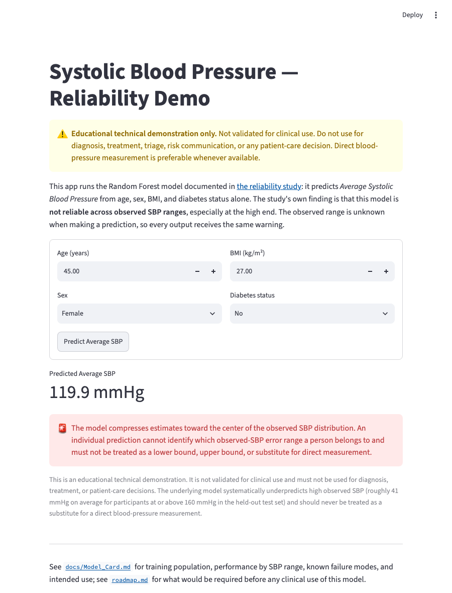

# Machine-Learning SBP Reliability Across Blood-Pressure Ranges

An end-to-end model-reliability and clinical error-profile study using NHANES 2017–March 2020 data.

> **Research question:** How reliable are machine-learning estimates of systolic blood pressure across clinically important blood-pressure ranges?

> **Bottom line:** reliability is not uniform. The final Random Forest performed best near the center of the observed SBP distribution but systematically overpredicted low SBP and underpredicted high SBP. Among test participants with observed SBP of 160 mmHg or greater, every estimate was too low and mean underprediction was approximately 40.75 mmHg. The model is not suitable for clinical use.

## Start here

- **[Portfolio notebook](notebook/02-portfolio-notebook-reframed-reliability.ipynb):** concise, hiring-manager-friendly reliability study
- **[Full technical notebook](notebook/01-project-notebook-reframed-reliability.ipynb):** expanded EDA, statistical diagnostics, tuning, range-specific error analysis, and SHAP failure investigation
- **[Model card](docs/Model_Card.md):** intended use, training population, performance by SBP range, and known failure modes
- **[Deployment roadmap](roadmap.md):** implications of the reliability findings and requirements beyond this benchmark

The original (pre-reframing) notebooks are preserved unchanged in [`notebook/archive/`](notebook/archive/) as a record of the earlier project framing.

## Reproducible pipeline and demo

Track 1 of the roadmap (portfolio-demo deployment) is implemented in `src/`, `tests/`, and `app.py`:

```bash
source bp-risk-env/bin/activate
pip install -r requirements-app.txt   # streamlit, pytest, joblib, etc. — on top of requirements.txt
python -m src.train                   # rebuilds the cohort and retrains the pipeline
pytest                                # runs the automated test suite
streamlit run app.py                  # launches the nonclinical demo UI
```

`src/data.py`, `src/pipeline.py`, and `src/train.py` reproduce the exact preprocessing and
Random Forest configuration selected in the technical notebook as reusable, tested code rather
than notebook cells — see [`docs/Model_Card.md`](docs/Model_Card.md) for the resulting artifact's
intended use and known failure modes.



The demo accepts only inputs within the documented training support (age 8 through the
NHANES top-coded `80+` category and BMI 12.5–80.6 kg/m²). Every illustrative prediction
receives the same reliability warning: an inference-time prediction cannot reveal which
observed-SBP error range a person belongs to, and it is not a lower or upper bound.

## Study design

- **Population:** NHANES participants aged 8 years or older with measured SBP
- **Target:** average of up to three oscillometric SBP readings
- **Predictors:** age, sex, BMI, and diabetes status
- **Analytical cohort:** 10,257 participants with complete modeling data
- **Validation:** 80/20 train-test split with five-fold cross-validation only within the training set
- **Overall metrics:** R², MAE, and RMSE
- **Primary reliability evidence:** error direction and magnitude across observed SBP ranges, supplemented by subgroup and extreme-case analysis

The SBP ranges are descriptive bins for evaluating model error; they are not presented as diagnostic categories.

## Model comparison

| Model | Mean CV R² | CV MAE | CV RMSE |
|---|---:|---:|---:|
| Linear Regression | 0.357 | 11.52 | 15.48 |
| Decision Tree | 0.365 | 11.37 | 15.38 |
| Random Forest | 0.378 | 11.24 | 15.22 |
| XGBoost | 0.378 | 11.24 | 15.22 |

Random Forest was selected because it was effectively tied with XGBoost while requiring fewer tuning decisions. Its held-out performance was R² = 0.372, MAE = 11.18 mmHg, and RMSE = 15.35 mmHg. The modest improvement over linear regression indicates that the central reliability limitation is not solved by choosing a more complex tested algorithm.

## Reliability across observed SBP ranges

| Observed SBP range | Participants | Mean residual | MAE | RMSE |
|---|---:|---:|---:|---:|
| <100 | 249 | −13.25 | 13.27 | 16.72 |
| 100–119 | 945 | −6.35 | 9.09 | 11.94 |
| 120–139 | 564 | 3.21 | 7.16 | 9.02 |
| 140–159 | 213 | 17.35 | 17.43 | 19.20 |
| 160+ | 81 | 40.75 | 40.75 | 43.67 |

Residual is defined as actual minus predicted SBP. Negative values indicate overprediction; positive values indicate underprediction. Near-zero aggregate bias conceals systematic regression toward the mean and severe underprediction at the high end.

## Why the model fails

- Age dominates predictive behavior across SHAP and permutation importance.
- Sex contributes a smaller but consistent signal.
- BMI contributes weak nonlinear information and behaves unstably in sparsely represented extremes.
- Diabetes status adds almost no incremental predictive value after the other features are known.
- The limited feature set cannot distinguish people whose SBP is unusually high or low for their demographic profile.
- The largest underprediction was 89.08 mmHg; the largest overprediction was 46.01 mmHg.

These findings explain the fitted model; they are not causal conclusions.

## Deployment recommendation

Do not deploy this model for diagnosis, treatment, triage, risk communication, or patient-care decisions. Direct BP measurement remains preferable whenever available. The current model is appropriate only as a transparent, nonclinical benchmark or a clearly labeled educational demonstration using synthetic inputs.

Further clinical development would require stronger predictors, target-sensitivity analysis, uncertainty estimates, a new validation cycle, temporal and external validation, prospective evaluation, explicit high-SBP safety criteria, and clinical governance.

## Reproduce the analysis

```bash
python -m venv bp-risk-env
source bp-risk-env/bin/activate
pip install -r requirements.txt
jupyter notebook
```

The notebooks download the required public NHANES files if they are not already available under `data/raw/`.

## Author

Iris Johnson
